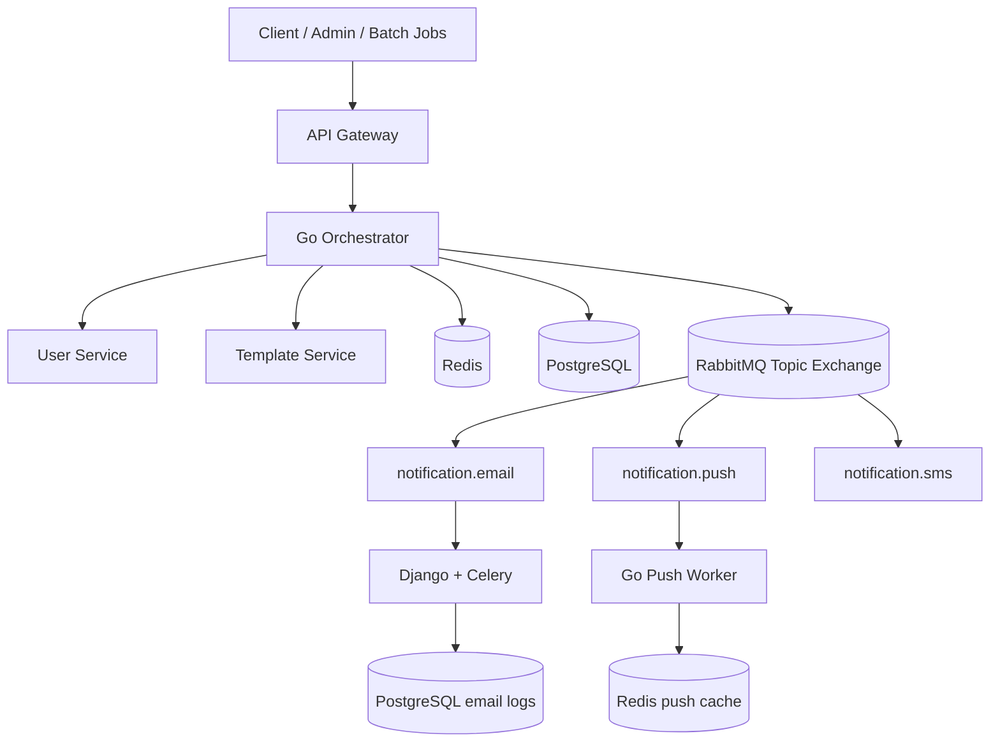
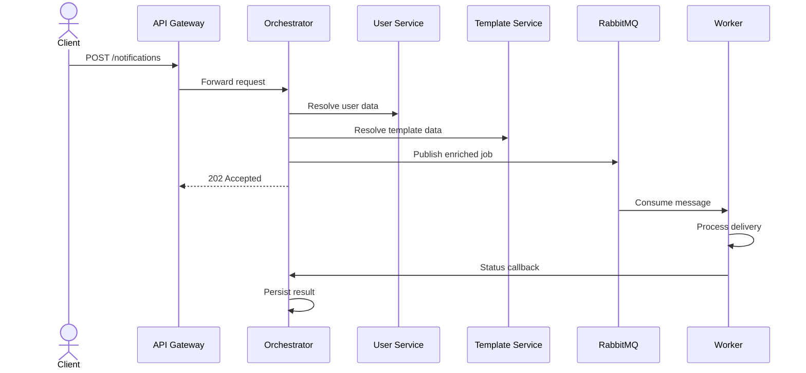
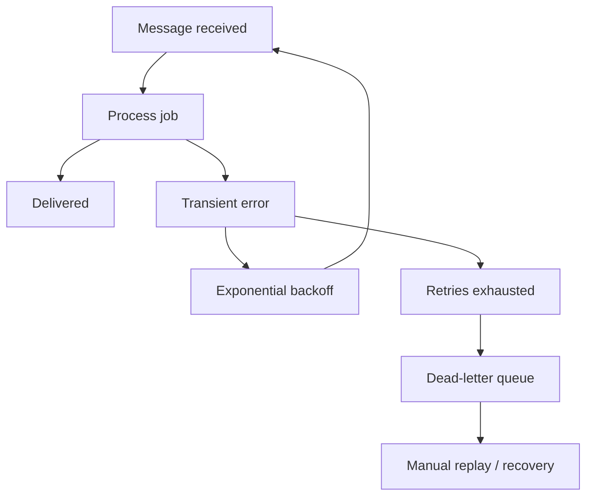

# Notification System

A production-grade, multi-channel notification platform built as a polyglot microservices monorepo. Designed around an event-driven pipeline with first-class support for reliability, observability, and horizontal scaling.

>Built to explore real-world distributed systems patterns: async task queues, dead-letter handling, circuit breakers, and multi-service orchestration — the kind of infrastructure that powers notification systems at scale.

**Current status:** Core infrastructure and email delivery are in place. The repository is a strong portfolio foundation, but several services still need to be completed before the system is production-ready end to end.

---

## Quick Summary

| Area | Details |
|---|---|
| **What it is** | Multi-channel notification platform with API ingress, orchestration, enrichment, and channel workers |
| **Primary flows** | Notification request, user/template enrichment, queue fan-out, email/push delivery, status tracking |
| **Main technologies** | NestJS, Go, Django, Celery, PostgreSQL, Redis, RabbitMQ |
| **Architecture style** | Event-driven microservices with worker-based async processing |
| **Portfolio value** | Shows systems design, scalability planning, observability thinking, and polyglot implementation |

---

## Project Status At a Glance

| Component | Status | Progress | What It Means |
|---|---|---:|---|
| API Gateway | Partial | 60% | Gateway structure and core edge concerns exist, but the notification flow still needs to be completed |
| Orchestrator | Partial | 70% | The Go service has the core wiring in place, but its API surface is still incomplete |
| Email Service | Ready | 100% | This is the most complete service and is the strongest production-ready part of the system |
| Template Service | Skeleton | 10% | Service exists, but CRUD, rendering, and tests still need to be built |
| User Service | Skeleton | 10% | Service exists, but profile and preference APIs still need to be implemented |
| Push Service | Empty | 0% | The service is only a scaffold and still needs the full push pipeline |
| Integration Tests | Missing | 0% | The end-to-end system flow is not yet protected by automated tests |
| Observability | Planned | 0% | Tracing, metrics, dashboards, and alerting still need to be added |
| Infrastructure | Ready | 90% | Local development stack is in place, with Docker Compose and bootstrap scripts available |

---

## What It Does

Clients submit notification requests through the API Gateway. The orchestrator enriches the request with user and template data, persists state, and publishes work to RabbitMQ. Dedicated workers consume channel-specific queues, process notifications independently, retry transient failures, and report delivery outcomes back to the system.

In practical terms: one request enters the system, and the platform handles routing, enrichment, retries, and delivery tracking with minimal coupling between services.

---

## Where The Project Is Today

### Implemented

| Service | Status | Notes |
|---|---|---|
| API Gateway | Partial | NestJS gateway, auth, proxying, rate limiting foundation |
| Orchestrator | Partial | Go service with DB, Redis, RabbitMQ, and client wiring |
| Email Service | Strongest component | Django + Celery email delivery flow, retries, logging, DLQ behavior |
| Infrastructure | Ready for local development | Docker Compose, Postgres, Redis, RabbitMQ, bootstrap scripts |

### Still Incomplete

| Service | Gap |
|---|---|
| Template Service | CRUD, rendering, validation, tests |
| User Service | Profile and preference APIs, caching, tests |
| Push Service | Full implementation, FCM integration, queue consumer |
| Orchestrator API | Status query and list endpoints, retry tooling |
| Observability | Tracing, metrics, dashboards, log aggregation |
| Integration tests | End-to-end test coverage across the whole flow |

---

<!-- ## Roadmap

### Phase 1: Complete Core Service APIs

- Finish Template Service CRUD and rendering.
- Finish User Service profile and preference endpoints.
- Wire the API Gateway notification endpoints end to end.
- Add status query support in the orchestrator.

### Phase 2: Complete Push Delivery

- Implement the Push Service from scratch.
- Add RabbitMQ consumer logic.
- Integrate FCM delivery.
- Add retry, idempotency, and status reporting.

### Phase 3: Production Hardening

- Add integration and end-to-end tests.
- Add OpenTelemetry tracing.
- Add Prometheus metrics and Grafana dashboards.
- Add dead-letter replay and admin workflows.

### Phase 4: Portfolio Polish

- Add API documentation.
- Add deployment/runbook docs.
- Add architecture visuals for review and presentation.
- Add a small admin UI if time allows. -->


## What I'd Add Next

- OpenTelemetry distributed tracing — correlation IDs exist in logs but traces don't span services yet. Adding OTEL would give end-to-end visibility into the full notification journey.
- Prometheus + Grafana — queue depth, retry rates, and delivery latency are the key metrics. Currently only logged, not scraped.
- Complete push service — FCM integration is scaffolded; needs device token management and delivery tracking to match the email service's reliability guarantees.
- Integration test suite — unit tests exist per service; an end-to-end test harness covering the full API Gateway → Orchestrator → Worker → DLQ path would give confidence for production deployment.
- Kubernetes manifests — Docker Compose works for local dev; the stateless services (orchestrator, workers) are ready to be replicated behind a load balancer with K8s deployments.

---

## Architecture Overview



### Request Flow



### Failure Handling



## Key design decisions:

- Go for the orchestrator and push worker — high-throughput, low-latency coordination. Goroutines handle concurrent enrichment calls without thread overhead.
- Django + Celery for email — Celery's task queue gives exponential backoff, max retry limits, and dead-letter routing out of the box, without reinventing the wheel.
- RabbitMQ topic exchange over direct queues — routing keys like notification.email allow future channels to be added without touching existing consumers.
- Redis for status caching — notification state is written to Redis on every transition so clients can poll status without hitting Postgres.
- Dead-letter queue (failed.queue) — exhausted retries land here for manual inspection and replay, not silent drops.
---

## System Design Notes

### Why this architecture works

- The gateway stays thin and protects downstream services.
- The orchestrator owns workflow coordination instead of business logic leaking into the edge layer.
- User and template services remain independent so enrichment can evolve separately.
- RabbitMQ decouples delivery from ingestion, which improves reliability and scaling.
- Channel workers can scale independently based on load.

### Reliability patterns already reflected in the design

- Async processing for non-blocking request handling.
- Retry with backoff for transient failures.
- Dead-letter queues for unrecoverable failures.
- Idempotency keys to reduce duplicate processing.
- Correlation IDs for tracing a request across services.

---

## Repository Layout

- `api-gateway/` - NestJS entrypoint for auth, throttling, and routing.
- `services/orchestrator/` - Go service for orchestration, enrichment, persistence, and publish flow.
- `services/email-service/` - Django + Celery worker for email delivery.
- `services/push-service/` - Go push worker scaffold.
- `services/template-service/` - NestJS template management service.
- `services/user-service/` - NestJS user profile and preference service.
- `packages/common/` - Shared TypeScript utilities and DTOs.
- `infra/` - Docker Compose infrastructure.
- `scripts/` - SQL bootstrap and setup scripts.

---

## Tech Stack

### Backend services

- **API Gateway:** NestJS, Express, JWT, Redis throttling
- **Orchestrator:** Go, Chi, PostgreSQL, RabbitMQ, Redis
- **Template Service:** NestJS, Prisma, PostgreSQL
- **User Service:** NestJS, Prisma, PostgreSQL
- **Email Service:** Django, Celery, PostgreSQL, structured logging
- **Push Service:** Go, RabbitMQ consumer, FCM

### Infrastructure

- **RabbitMQ** for queueing, routing, and retries
- **Redis** for status caching and throttling
- **PostgreSQL** for durable state and logs
- **Docker Compose** for local development

---

## Local Development

### Prerequisites

- Node.js 20+
- Go 1.21+
- Python 3.11+
- Docker and Docker Compose

### Start the infrastructure

```bash
docker compose -f infra/docker-compose.local.yaml up --build
```

### Run the services

```bash
# API Gateway
cd api-gateway && npm install && npm run start:dev

# Template Service
cd services/template-service && npm install && npm run start:dev

# User Service
cd services/user-service && npm install && npm run start:dev

# Orchestrator
cd services/orchestrator && go run cmd/orchestrator/main.go

# Email Service
cd services/email-service && pip install -r requirements.txt && python manage.py runserver

# Celery worker
cd services/email-service && celery -A email_service worker -l info
```

### Verify health

```bash
curl http://localhost:3000/health
curl http://localhost:8080/health
curl http://localhost:3003/template-service/health
curl http://localhost:3007/user-service/health
curl http://localhost:8000/api/v1/health
```

---

## API Examples

### Submit a notification

```http
POST /notifications
Content-Type: application/json
Authorization: Bearer <jwt>
```

```json
{
  "notification_type": "email",
  "user_id": "user-123",
  "template_code": "welcome",
  "variables": {
    "email": "user@example.com",
    "name": "John Doe"
  },
  "request_id": "req-123"
}
```

### Query delivery status

```http
GET /notifications/{notification_id}
Authorization: Bearer <jwt>
```

---

## Testing

- TypeScript services: `npm run test`, `npm run lint`
- Go services: `go test ./...`, `gofmt`, `go vet`
- Django email service: `python manage.py test notifications`

### Highest priority testing gap

The main missing piece is a full end-to-end test suite that exercises the entire notification lifecycle across gateway, orchestrator, queue, and workers.

---

## Deployment Notes

- Stateless services can be horizontally scaled behind a load balancer.
- RabbitMQ queues should be durable and monitored for depth.
- PostgreSQL should use backups and read replicas in production.
- Redis should be password-protected and highly available in production.
- Dead-letter queues should be visible in an operations workflow for replay and recovery.

---


<!-- ## Contributing Focus Areas

The most valuable next contributions are:

- Template Service CRUD and rendering
- User Service endpoints and preferences
- Push Service implementation
- End-to-end test coverage
- Observability and dashboards
- Admin tooling for failed-message replay

--- -->

## License

MIT
