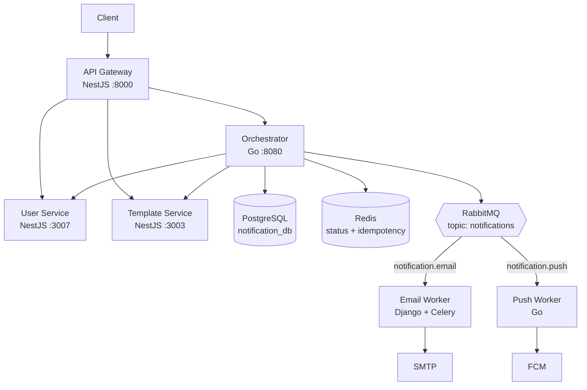

# Notification System

A multi-channel notification platform built as a polyglot microservices monorepo — NestJS at the edge, Go for orchestration and push delivery, Django + Celery for email, with RabbitMQ decoupling ingestion from delivery.

Built to work through real distributed-systems problems end to end: async task queues, service enrichment, idempotency, retry and dead-letter handling, circuit breakers, and cross-service correlation.

---

## What it does

A client submits one notification request. The platform figures out the rest:

1. **The API Gateway** authenticates the caller, applies edge concerns, and forwards the request.
2. **The Orchestrator** assigns a notification ID, records it, and enriches the bare request — fetching the recipient's contact details and delivery preferences from the User Service, and the message template from the Template Service, concurrently.
3. **RabbitMQ** receives the enriched job on a topic exchange, routed by channel (`notification.email`, `notification.push`).
4. **Channel workers** consume their own queue independently, deliver the message, retry transient failures with backoff, and dead-letter what they can't deliver.
5. **Status** is written back to Postgres as a durable event log and cached in Redis for cheap polling.

The caller gets a `202 Accepted` immediately. Delivery happens asynchronously, and each channel scales on its own.

---

## Project status

**This is a work in progress.** Every service runs; the pipeline between them is not yet connected end to end.

| Component | State | Notes |
|---|---|---|
| API Gateway | Working | JWT validation, proxying, correlation/idempotency header injection. Rate limiting is built but not wired up |
| Orchestrator | Partial | Ingest, enrich, persist, and publish all work. No status/query API yet |
| User Service | Working | Auth, profiles, preferences, push tokens, Redis caching |
| Template Service | Working | Full CRUD, versioning, filtering, Handlebars rendering, Redis caching |
| Push Service | Partial | AMQP consumer + FCM v1 client are built. Doesn't yet receive usable messages |
| Email Service | Standalone | Complete and works on its own. Not yet connected to the queue or deployed in Compose |
| Infrastructure | Working | Postgres, Redis, RabbitMQ, pgAdmin via Docker Compose |
| Tests | Not started | Spec files are scaffolding stubs; no meaningful coverage |
| Observability | Not started | Structured logs and correlation IDs only — no metrics or tracing |

**What works today:** you can sign up, authenticate, manage templates and preferences, and submit a notification that gets enriched, persisted, and published to RabbitMQ.

**What doesn't yet:** nothing is delivered at the far end. Email is not attached to the queue, and push messages arrive without device tokens. See [`PROJECT_CONTEXT.md`](./PROJECT_CONTEXT.md) for the full analysis and the plan to close it.

---

## Architecture



Three ideas carry the design:

- **The gateway stays thin.** It handles auth and edge concerns, then gets out of the way. No business logic at the edge.
- **The orchestrator owns coordination, not delivery.** It knows how to assemble a complete message; it doesn't know how to send one. Channels stay pluggable.
- **The queue is the boundary.** Ingestion never blocks on delivery. A failing SMTP host slows the email queue and nothing else.

For component responsibilities, the message topology, the data model, and the reasoning behind each decision, see **[`docs/ARCHITECTURE.md`](./docs/ARCHITECTURE.md)**.

---

## Tech stack

| Layer | Choice | Why |
|---|---|---|
| Edge | NestJS, Express, Passport JWT | Mature middleware ecosystem, DI, fast to extend |
| Orchestration | Go, chi, pgx, koanf, zerolog | Concurrent enrichment fan-out with goroutines; low latency under load |
| Email delivery | Django, Celery, pybreaker | Celery gives backoff, retry limits, and dead-lettering without reinventing them |
| Push delivery | Go, FCM HTTP v1 | Same reasoning as the orchestrator; shared idioms with the Go codebase |
| Domain services | NestJS, Prisma | Type-safe data access and migrations |
| Messaging | RabbitMQ (topic exchange) | Routing keys let new channels be added without touching existing consumers |
| State | PostgreSQL (partitioned), Redis | Durable event log; Redis for status cache, idempotency keys, throttling |
| Local dev | Docker Compose | One command for the whole stack |
| Monorepo | pnpm workspaces + Nx, Go workspaces | Per-language tooling without splitting the repo |

---

## Getting started

### Prerequisites

- Docker and Docker Compose
- Node.js 20+ and pnpm 10+
- Go 1.25+
- Python 3.11+

### 1. Configure environment

Each service ships an `.env.example`. Copy the ones you need:

```bash
cp infra/.env.example infra/.env
cp api-gateway/.env.example api-gateway/.env
cp services/orchestrator/.env.example services/orchestrator/.env
cp services/user-service/.env.example services/user-service/.env
cp services/template-service/.env.example services/template-service/.env
cp services/push-service/.env.example services/push-service/.env
cp services/email-service/.env.example services/email-service/.env
```

Set at minimum the following in `infra/.env`:

| Variable | Notes |
|---|---|
| `JWT_SECRET` | Must be identical across the gateway, user, and template services |
| `INTERNAL_SERVICE_TOKEN` | Shared secret for service-to-service calls. Required — the orchestrator, user, and template services all refuse to start without it |
| `DB_PASSWORD` | Postgres password |
| `RABBITMQ_PASSWORD` | RabbitMQ password |
| `REDIS_PASSWORD` | Optional; leave unset for a passwordless local Redis |

### 2. Start everything

```bash
docker compose -f infra/docker-compose.local.yaml up --build
```

This brings up Postgres (with the three databases created by `scripts/init-databases.sql`), Redis, RabbitMQ, pgAdmin, and the gateway, orchestrator, user, template, and push services. The orchestrator runs its own migrations on boot.

> The email service is not yet in Compose — run it separately (see below).

### 3. Or run services individually

```bash
pnpm install                    # installs all TypeScript workspaces

# API Gateway
pnpm --filter api-gateway start:dev

# User Service
pnpm --filter user-service start:dev

# Template Service
pnpm --filter template-service start:dev

# Orchestrator
cd services/orchestrator && go run cmd/orchestrator/main.go

# Push Service
cd services/push-service && go run cmd/push-service/main.go

# Email Service
cd services/email-service
pip install -r requirements.txt
python manage.py migrate
python manage.py runserver 8000

# Celery worker (separate terminal)
cd services/email-service && celery -A email_service worker -l info
```

### 4. Verify

```bash
curl http://localhost:8000/health                      # API Gateway
curl http://localhost:3002/health                      # Orchestrator (mapped from :8080)
curl http://localhost:3007/user-service/health         # User Service
curl http://localhost:3003/template-service/health     # Template Service
curl http://localhost:8000/health/                     # Email Service (when running)
```

Supporting UIs: RabbitMQ management at `http://localhost:15672`, pgAdmin at `http://localhost:5050`.

---

## Service catalog

### API Gateway — `:8000`

Proxies `/user` → User Service, `/template` → Template Service, `/notifications` → Orchestrator. Injects `X-Correlation-ID` and `X-Idempotency-Key` (generating them when absent) and forwards `x-user-id` on authenticated routes.

The proxy preserves the full request path, so downstream route prefixes must match the gateway mount point — `/user`, `/template`, and `/notifications` all line up with their target service's route prefix.

| Method | Route | Auth |
|---|---|---|
| `GET` | `/health` | Public |

### User Service — `:3007`

| Method | Route | Auth |
|---|---|---|
| `POST` | `/user/signup` | Public |
| `POST` | `/user/signin` | Public |
| `GET` | `/user` | Admin |
| `GET` | `/user/preference` | Admin |
| `GET` | `/user/:id` | JWT |
| `GET` | `/user/preference/:id` | JWT or service token |
| `PATCH` | `/user/:id/preference` | JWT (self) |
| `PATCH` | `/user/:id/push-token` | JWT (self) |
| `PATCH` | `/user/:id/role` | Admin |
| `GET` | `/user-service/health` | Public |

### Template Service — `:3003`

| Method | Route | Auth |
|---|---|---|
| `POST` | `/template` | Admin |
| `GET` | `/template` | JWT — paginated, filter by `name`/`language`/`event`/`channel` |
| `GET` | `/template/:id` | JWT or service token — `?history=true` includes all versions |
| `POST` | `/template/:id/render` | JWT or service token — renders with Handlebars |
| `GET` | `/template/event/:event/channel/:channel` | JWT or service token |
| `PATCH` | `/template/:id` | JWT — creates a new version |
| `DELETE` | `/template/:id` | JWT |
| `GET` | `/template-service/health` | Public |

### Orchestrator — `:8080` (mapped to `:3002`)

| Method | Route |
|---|---|
| `POST` | `/notifications` |
| `GET` | `/health` |

### Push Service — `:8080`

Consumes `notification.push`. HTTP surface is operational only:

| Method | Route |
|---|---|
| `GET` | `/health` |
| `GET` | `/ready` |
| `GET` | `/status/:notification_id` |

### Email Service — `:8000`

| Method | Route |
|---|---|
| `POST` | `/api/v1/notifications/` |
| `GET` | `/api/v1/notifications/:request_id/` |
| `GET` | `/api/v1/notifications/list/` |
| `GET` | `/health/` |

---

## API usage

All HTTP services return the same envelope:

```json
{
  "success": true,
  "data": {},
  "message": "Request successful",
  "meta": {}
}
```

### Authenticate

```bash
curl -X POST http://localhost:8000/user/signup \
  -H 'Content-Type: application/json' \
  -d '{"name":"Ada","email":"ada@example.com","password":"secret123"}'

curl -X POST http://localhost:8000/user/signin \
  -H 'Content-Type: application/json' \
  -d '{"email":"ada@example.com","password":"secret123"}'
```

### Submit a notification

```bash
curl -X POST http://localhost:8000/notifications \
  -H 'Content-Type: application/json' \
  -H "Authorization: Bearer $TOKEN" \
  -H 'X-Idempotency-Key: req-123' \
  -d '{
    "notification_type": "email",
    "user_id": "<user-uuid>",
    "template_code": "<template-uuid>",
    "variables": { "name": "Ada", "link": "https://example.com" },
    "request_id": "req-123",
    "priority": 2
  }'
```

`X-Idempotency-Key` is required — the orchestrator rejects requests without it. The gateway generates one if the client omits it.

```json
{
  "success": true,
  "message": "Notification accepted and being processed",
  "data": {
    "correlation_id": "…",
    "idempotency_key": "req-123",
    "status": "processing"
  }
}
```

---

## Repository layout

```
├── api-gateway/              NestJS edge service — auth, proxying, throttling
├── services/
│   ├── orchestrator/         Go — enrichment, persistence, publishing
│   │   ├── cmd/              Entrypoint
│   │   └── internal/         handlers, services, repositories, models, config
│   ├── user-service/         NestJS + Prisma — users, auth, preferences
│   ├── template-service/     NestJS + Prisma — templates, versions, rendering
│   ├── push-service/         Go — AMQP consumer, FCM delivery
│   └── email-service/        Django + Celery — SMTP delivery, retries, DLQ
├── packages/common/          Shared TypeScript utilities
├── infra/                    Docker Compose stacks
├── scripts/                  Database bootstrap SQL
├── docs/ARCHITECTURE.md      Architecture reference
└── PROJECT_CONTEXT.md        Current-state audit and completion plan
```

---

## Testing

```bash
# TypeScript services
pnpm --filter <service> test
pnpm --filter <service> lint

# Go services
cd services/orchestrator && go test ./... && go vet ./...
cd services/push-service  && go test ./... && go vet ./...

# Email service
cd services/email-service && python manage.py test notifications
```

Test coverage is the largest outstanding gap. The `.spec.ts` files present today are generated scaffolding, not real tests, and some fail to resolve `src/*` imports under Jest. Building out unit tests and an end-to-end harness across gateway → orchestrator → queue → worker is the top priority after the delivery pipeline is connected.

---

## Roadmap

Sequenced in detail in [`PROJECT_CONTEXT.md`](./PROJECT_CONTEXT.md):

1. **Connect the pipeline** — resolve recipients and device tokens during enrichment, render templates in the orchestrator, agree one message contract, bridge the email worker onto the queue, and deploy it in Compose.
2. **Complete the orchestrator API** — status lookup, event timeline, user history, and retry endpoints. The repository layer for these is already written.
3. **Harden reliability** — transactional outbox, correct idempotency semantics, real dead-letter exchanges, publisher confirms, and scheduled partition maintenance.
4. **Secure the edge** — move proxying behind Nest guards so auth and rate limiting actually apply.
5. **Test, then instrument** — real unit and integration coverage, CI, then OpenTelemetry tracing and Prometheus metrics.

---

## License

MIT
