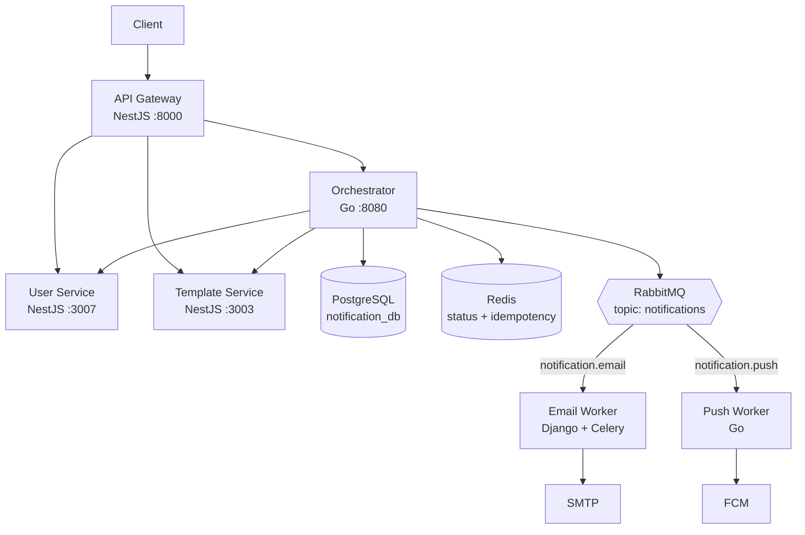

# Notification System

A multi-channel notification platform built as a polyglot microservices monorepo — NestJS at the edge, Go for orchestration and push delivery, Django + Celery for email, with RabbitMQ decoupling ingestion from delivery.

Built to work through real distributed-systems problems end to end: a transactional outbox that survives a broker restart, correct idempotency semantics, dead-letter handling, publisher confirms, circuit breakers, and cross-service correlation.

---

## What it does

A client submits one notification request. The platform figures out the rest:

1. **The API Gateway** authenticates the caller, applies edge concerns, and forwards the request.
2. **The Orchestrator** assigns a notification ID, records it, and enriches the bare request — fetching the recipient's contact details and delivery preferences from the User Service, and the message template from the Template Service, concurrently.
3. **RabbitMQ** receives the enriched job on a topic exchange, routed by channel (`notification.email`, `notification.push`).
4. **Channel workers** consume their own queue independently, deliver the message, retry transient failures with backoff, and dead-letter what they can't deliver.
5. **Status** is written back to Postgres as a durable event log and cached in Redis for cheap polling.

The caller gets a `202 Accepted` immediately. Delivery happens asynchronously, and each channel scales on its own.

---

## Project status

Email delivery works end to end and is covered by CI. Push delivery is built but unproven against a real FCM project.

| Component | State | Notes |
|---|---|---|
| API Gateway | Working | JWT auth and Redis-backed rate limiting enforced on every proxied route |
| Orchestrator | Working | Enrichment, rendering, transactional outbox, status/query API, retry |
| User Service | Working | Auth, profiles, preferences, device tokens, Redis caching |
| Template Service | Working | CRUD, versioning, filtering, Handlebars rendering, Redis caching |
| Push Service | Built, unproven | AMQP consumer and FCM v1 client run; never exercised against a real FCM project. iOS/APNS is a stub |
| Email Service | Working | Django + Celery, bridged to the queue, delivering through SMTP |
| Infrastructure | Working | Postgres, Redis, RabbitMQ, Prometheus, Grafana, MailHog via Docker Compose |
| Tests | Working | ~80 unit tests plus an end-to-end CI job that builds every image and delivers a real notification |
| Observability | Metrics | Prometheus metrics, a Grafana dashboard and seven alert rules. Distributed tracing is not built |

**What works today:** a notification submitted through the gateway is authenticated, enriched with the recipient's contact details and consent, rendered from a versioned template, committed to a transactional outbox, published to RabbitMQ, delivered by email, and reported back — with the whole lifecycle queryable through the API.

**What doesn't yet:** push notifications have never been sent to a real device, there is no distributed tracing, and the repository still carries duplicated Prisma schemas and two divergent Compose files. See [`docs/ENGINEERING_LOG.md`](./docs/ENGINEERING_LOG.md).

---

## Architecture



Three ideas carry the design:

- **The gateway stays thin.** It handles auth and edge concerns, then gets out of the way. No business logic at the edge.
- **The orchestrator owns coordination, not delivery.** It knows how to assemble a complete message; it doesn't know how to send one. Channels stay pluggable.
- **The queue is the boundary.** Ingestion never blocks on delivery. A failing SMTP host slows the email queue and nothing else.

For component responsibilities, the message topology, the data model, and the reasoning behind each decision, see **[`docs/ARCHITECTURE.md`](./docs/ARCHITECTURE.md)**.

---

## Tech stack

| Layer | Choice | Why |
|---|---|---|
| Edge | NestJS, Express, Passport JWT | Mature middleware ecosystem, DI, fast to extend |
| Orchestration | Go, chi, pgx, koanf, zerolog | Concurrent enrichment fan-out with goroutines; low latency under load |
| Email delivery | Django, Celery, pybreaker | Celery gives backoff, retry limits, and dead-lettering without reinventing them |
| Push delivery | Go, FCM HTTP v1 | Same reasoning as the orchestrator; shared idioms with the Go codebase |
| Domain services | NestJS, Prisma | Type-safe data access and migrations |
| Messaging | RabbitMQ (topic exchange) | Routing keys let new channels be added without touching existing consumers |
| State | PostgreSQL (partitioned), Redis | Durable event log; Redis for status cache, idempotency keys, throttling |
| Local dev | Docker Compose | One command for the whole stack |
| Monorepo | pnpm workspaces + Nx, Go workspaces | Per-language tooling without splitting the repo |

---

## Getting started

### Prerequisites

- Docker and Docker Compose
- Node.js 20+ and pnpm 10+
- Go 1.25+
- Python 3.11+

### 1. Configure environment

Each service ships an `.env.example`. Copy the ones you need:

```bash
cp infra/.env.example infra/.env
cp api-gateway/.env.example api-gateway/.env
cp services/orchestrator/.env.example services/orchestrator/.env
cp services/user-service/.env.example services/user-service/.env
cp services/template-service/.env.example services/template-service/.env
cp services/push-service/.env.example services/push-service/.env
cp services/email-service/.env.example services/email-service/.env
```

Set at minimum the following in `infra/.env`:

| Variable | Notes |
|---|---|
| `JWT_SECRET` | Must be identical across every service. Signs user tokens *and* the short-lived service tokens the orchestrator and email worker mint for internal calls |
| `DB_PASSWORD` | Postgres password |
| `RABBITMQ_PASSWORD` | RabbitMQ password |
| `REDIS_PASSWORD` | Optional; leave unset for a passwordless local Redis |

### 2. Start everything

```bash
docker compose -f infra/docker-compose.local.yaml up --build
```

This brings up Postgres (with the three databases created by `scripts/init-databases.sql`), Redis, RabbitMQ, pgAdmin, and the gateway, orchestrator, user, template, and push services. The orchestrator runs its own migrations on boot.

This includes the email service and its Celery worker, the queue bridge, MailHog
(so local runs never send real mail), Prometheus and Grafana.

### 3. Or run services individually

```bash
pnpm install                    # installs all TypeScript workspaces

# API Gateway
pnpm --filter api-gateway start:dev

# User Service
pnpm --filter user-service start:dev

# Template Service
pnpm --filter template-service start:dev

# Orchestrator
cd services/orchestrator && go run cmd/orchestrator/main.go

# Push Service
cd services/push-service && go run cmd/push-service/main.go

# Email Service
cd services/email-service
pip install -r requirements.txt
python manage.py migrate
python manage.py runserver 8000

# Celery worker (separate terminal)
cd services/email-service && celery -A email_service worker -l info
```

### 4. Create the first admin

Templates can only be created by an admin, and `role` is deliberately not
settable at signup — otherwise anyone could register as one. Bootstrap it once:

```bash
docker compose -f infra/docker-compose.local.yaml exec \
  -e ADMIN_EMAIL=admin@example.com -e ADMIN_PASSWORD='choose-a-strong-password' \
  user-service sh -c 'cd /usr/src/app/services/user-service && pnpm seed:admin'
```

Idempotent: re-running promotes an existing account rather than duplicating it.

### 5. Verify

```bash
curl http://localhost:8000/health                      # API Gateway
curl http://localhost:3002/health                      # Orchestrator (mapped from :8080)
curl http://localhost:3007/user-service/health         # User Service
curl http://localhost:3003/template-service/health     # Template Service
curl http://localhost:8000/health/                     # Email Service (when running)
```

### 6. Prove it end to end

```bash
./scripts/smoke-test.sh
```

Signs up a user, creates a template, submits a notification, and asserts the
email actually arrived — then re-submits to confirm it is deduplicated. This is
the same script CI runs against a freshly built stack.

Supporting UIs: Grafana at `http://localhost:3001`, Prometheus at
`http://localhost:9090`, MailHog at `http://localhost:8025`, RabbitMQ management
at `http://localhost:15672`, pgAdmin at `http://localhost:5050`.

---

## Service catalog

### API Gateway — `:8000`

Proxies `/user` → User Service, `/template` → Template Service, `/notifications` → Orchestrator. Injects `X-Correlation-ID` and `X-Idempotency-Key` (generating them when absent) and forwards `x-user-id` on authenticated routes.

The proxy preserves the full request path, so downstream route prefixes must match the gateway mount point — `/user`, `/template`, and `/notifications` all line up with their target service's route prefix.

| Method | Route | Auth |
|---|---|---|
| `GET` | `/health` | Public |

### User Service — `:3007`

| Method | Route | Auth |
|---|---|---|
| `POST` | `/user/signup` | Public |
| `POST` | `/user/signin` | Public |
| `GET` | `/user` | Admin |
| `GET` | `/user/preference` | Admin |
| `GET` | `/user/:id` | JWT |
| `GET` | `/user/preference/:id` | JWT (a user's or a service's) |
| `PATCH` | `/user/:id/preference` | JWT (self) |
| `PATCH` | `/user/:id/device-tokens` | JWT (self) — FCM registration tokens |
| `PATCH` | `/user/:id/role` | Admin |
| `GET` | `/user-service/health` | Public |

### Template Service — `:3003`

| Method | Route | Auth |
|---|---|---|
| `POST` | `/template` | Admin |
| `GET` | `/template` | JWT — paginated, filter by `name`/`language`/`event`/`channel` |
| `GET` | `/template/:id` | JWT — `?history=true` includes all versions |
| `POST` | `/template/:id/render` | JWT — compiles Handlebars against a supplied context |
| `GET` | `/template/event/:event/channel/:channel` | JWT |
| `PATCH` | `/template/:id` | JWT — creates a new version |
| `DELETE` | `/template/:id` | JWT |
| `GET` | `/template-service/health` | Public |

### Orchestrator — `:8080` (mapped to `:3002`)

| Method | Route | Notes |
|---|---|---|
| `POST` | `/notifications` | Submit; requires `X-Idempotency-Key` |
| `GET` | `/notifications?user_id=&limit=&cursor=` | Cursor-paginated history |
| `GET` | `/notifications/{id}` | Single notification with lifecycle timestamps |
| `GET` | `/notifications/correlation/{id}` | Polling path; Redis-cached |
| `GET` | `/notifications/{id}/events` | Audit timeline |
| `POST` | `/notifications/{id}/retry` | Requeue a failed notification |
| `POST` | `/notifications/status` | Worker callback; service token only |
| `GET` | `/health` | |
| `GET` | `/metrics` | Prometheus scrape target |

### Push Service — `:8080`

Consumes `notification.push`. HTTP surface is operational only:

| Method | Route |
|---|---|
| `GET` | `/health` |
| `GET` | `/ready` |
| `GET` | `/status/:notification_id` |

### Email Service — `:8000`

| Method | Route |
|---|---|
| `POST` | `/api/v1/notifications/` |
| `GET` | `/api/v1/notifications/:request_id/` |
| `GET` | `/api/v1/notifications/list/` |
| `GET` | `/health/` |

---

## API usage

All HTTP services return the same envelope:

```json
{
  "success": true,
  "data": {},
  "message": "Request successful",
  "meta": {}
}
```

### Authenticate

```bash
curl -X POST http://localhost:8000/user/signup \
  -H 'Content-Type: application/json' \
  -d '{"name":"Ada","email":"ada@example.com","password":"secret123"}'

curl -X POST http://localhost:8000/user/signin \
  -H 'Content-Type: application/json' \
  -d '{"email":"ada@example.com","password":"secret123"}'
```

### Submit a notification

```bash
curl -X POST http://localhost:8000/notifications \
  -H 'Content-Type: application/json' \
  -H "Authorization: Bearer $TOKEN" \
  -H 'X-Idempotency-Key: req-123' \
  -d '{
    "notification_type": "email",
    "user_id": "<user-uuid>",
    "template_code": "<template-uuid>",
    "variables": { "name": "Ada", "link": "https://example.com" },
    "request_id": "req-123",
    "priority": 2
  }'
```

`X-Idempotency-Key` is required — the orchestrator rejects requests without it. The gateway generates one if the client omits it.

```json
{
  "success": true,
  "message": "Notification accepted and being processed",
  "data": {
    "correlation_id": "…",
    "idempotency_key": "req-123",
    "status": "processing"
  }
}
```

---

## Repository layout

```
├── api-gateway/              NestJS edge service — auth, proxying, throttling
├── services/
│   ├── orchestrator/         Go — enrichment, persistence, publishing
│   │   ├── cmd/              Entrypoint
│   │   └── internal/         handlers, services, repositories, models, config
│   ├── user-service/         NestJS + Prisma — users, auth, preferences
│   ├── template-service/     NestJS + Prisma — templates, versions, rendering
│   ├── push-service/         Go — AMQP consumer, FCM delivery
│   └── email-service/        Django + Celery — SMTP delivery, retries, DLQ
├── packages/common/          Shared TypeScript utilities
├── infra/                    Docker Compose stacks
├── scripts/                  Database bootstrap SQL
└── docs/
    ├── ARCHITECTURE.md       Components, topology, data model, design rationale
    ├── ENGINEERING_LOG.md    Line-referenced audit of what was broken and why
    └── contracts/            The message contract between services
```

---

## Testing

```bash
# TypeScript services
pnpm --filter <service> test
pnpm --filter <service> lint

# Go services
cd services/orchestrator && go test ./... && go vet ./...
cd services/push-service  && go test ./... && go vet ./...

# Email service
cd services/email-service && python manage.py test notifications
```

CI runs four jobs on every push: Go (vet, gofmt, `-race`), TypeScript, Python,
and an **end-to-end** job that builds every image, starts the full stack and
delivers a real notification.

That last job earns its keep. Most failures this project has hit were invisible
to compilation — an unpinned tool that outgrew its base image, a UTF-16
`requirements.txt`, a dependency missing from a manifest, a queue argument
mismatch, and Dockerfiles that only worked because the developer's
`node_modules` happened to be in the build context. A pipeline that only
compiled would have caught none of them.

---

## Documentation

| Document | What it covers |
|---|---|
| [Architecture](./docs/ARCHITECTURE.md) | Component responsibilities, messaging topology, data model, and the reasoning behind each decision |
| [Message contract](./docs/contracts/enriched-notification.md) | The schema every worker consumes, and the rule for changing it |
| [Engineering log](./docs/ENGINEERING_LOG.md) | A line-referenced record of what was broken, why it was invisible, and how it was fixed |

Each service has its own README covering what it owns and why it works the way
it does: [gateway](./api-gateway/README.md) ·
[orchestrator](./services/orchestrator/README.md) ·
[user](./services/user-service/README.md) ·
[template](./services/template-service/README.md) ·
[push](./services/push-service/README.md) ·
[email](./services/email-service/README.md)

---

## Roadmap

Tracked in detail in [`docs/ENGINEERING_LOG.md`](./docs/ENGINEERING_LOG.md). What remains:

1. **Prove push delivery** — the FCM client and consumer are built but have never
   sent to a real device. iOS/APNS is a stub.
2. **Distributed tracing** — correlation IDs already thread through the logs;
   OpenTelemetry would join them into spans across Go, NestJS and Django.
3. **Consolidation** — split the duplicated Prisma schema, reconcile the two
   Compose files, and remove the remaining commented-out code.
4. **Deployment** — Kubernetes manifests. The stateless services are ready for
   it; nothing is written yet.

---

## License

MIT
