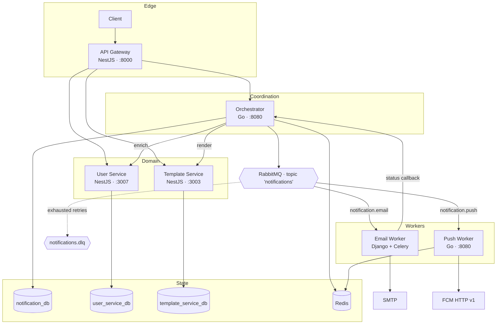
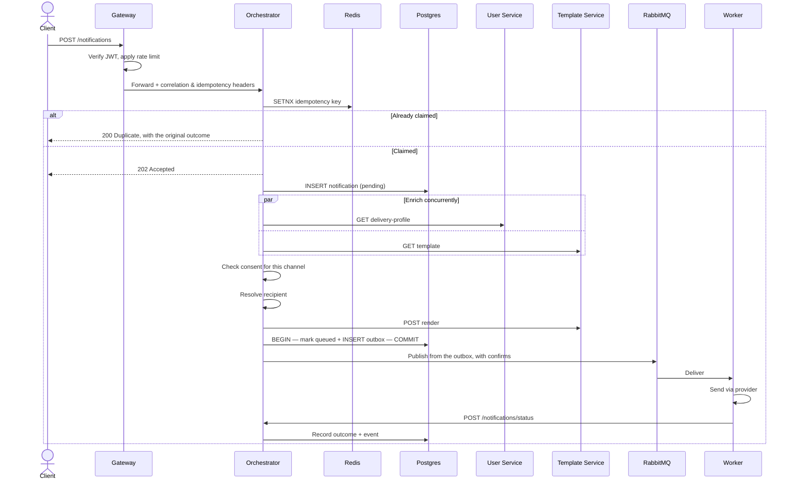
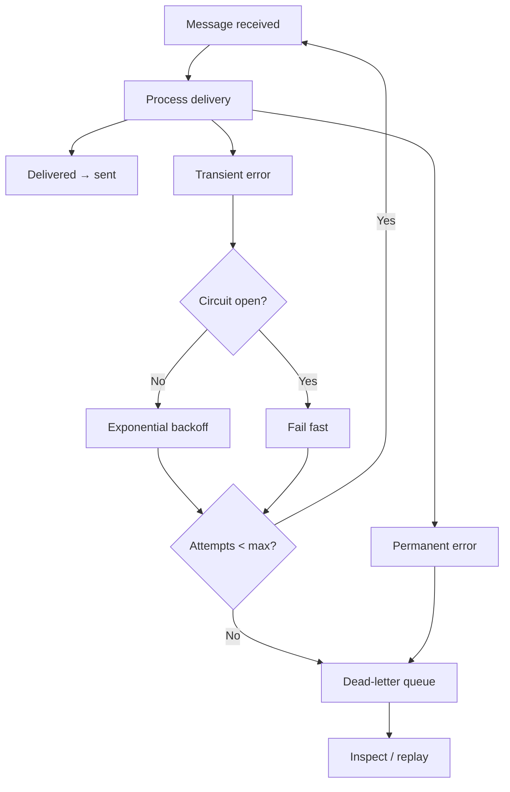

# Architecture

How the Notification System is put together: component responsibilities, the
path a notification takes, the messaging topology, the data model, and the
reasoning behind the significant decisions.

Related: [API reference](./API.md) ·
[Message contract](./contracts/enriched-notification.md) ·
[Operations](./OPERATIONS.md) · [Development](./DEVELOPMENT.md)

---

## 1. Design principles

**Thin edge.** The gateway authenticates, rate-limits, stamps correlation
headers and routes. It holds no business logic — anything it knows about the
domain is a leak.

**Coordination is separate from delivery.** The orchestrator knows how to
assemble a complete, deliverable message. It does not know what SMTP or FCM are.
Adding a channel means writing a consumer, not editing the orchestrator.

**The queue is the boundary.** Accepting a request and delivering it are
decoupled. A slow SMTP host delays the email queue and nothing else, and each
channel scales on its own load profile.

**Messages are self-contained.** By the time a message reaches a worker the
recipient is resolved and the content is rendered. A worker never calls back
into the system to find out who it is writing to or what to say.

**Services own their data.** Each service has its own database. Nothing reaches
across a boundary with SQL; enrichment happens over HTTP.

**State changes are durable before they are announced.** A notification's status
and the intent to publish it commit in the same transaction, so a process that
dies mid-flight loses nothing.

---

## 2. Topology

---

## 3. Components

### API Gateway — `api-gateway/`

Single entry point. Validates JWTs, enforces rate limits, injects correlation
and idempotency headers, and reverse-proxies to the owning service.

| | |
|---|---|
| Stack | NestJS 11, Express, `express-http-proxy`, Passport JWT, ioredis |
| Owns | No persistent state; Redis holds throttle counters |
| Key files | `src/proxy/`, `src/auth/jwt-auth.guard.ts`, `src/throttler/` |

Proxying is implemented as **controllers**, not middleware. Middleware
registered with `app.use()` runs before Nest's router, so guards and
interceptors never see it and proxied traffic would bypass authentication and
rate limiting. Controllers place it inside the pipeline.

Public routes are declared with `@Public()` on the handler, so exemption is a
property of the route rather than a pattern matched against the URL and cannot
drift from the endpoint it protects.

The full request path is forwarded unchanged, including the mount prefix. A
downstream service's route prefix therefore matches the gateway's, which keeps
paths stable end to end and makes logs comparable across hops.

### Orchestrator — `services/orchestrator/`

The workflow engine: accepts a request, enforces idempotency, enriches, renders,
persists, and hands off to the queue.

| | |
|---|---|
| Stack | Go 1.25, chi, pgx/v5, tern, koanf, zerolog, streadway/amqp |
| Owns | `notification_db` — `notifications`, `notification_events`, `notification_outbox` |
| Key files | `internal/services/`, `internal/repositories/`, `internal/handlers/` |

Layered `handlers → services → repositories`, with `app.App` as the dependency
container assembled in `cmd/orchestrator/main.go`.

Downstream calls go through `BaseHTTPClient`, which applies exponential backoff
with a 30-second ceiling and classifies `4xx` as permanent — retrying a
malformed request only wastes capacity — while retrying `5xx` and transport
errors.

### User Service — `services/user-service/`

Identity and delivery preferences.

| | |
|---|---|
| Stack | NestJS 11, Prisma 6, bcrypt, Passport JWT, ioredis |
| Owns | `user_service_db` — `User`, `Preference` |

`GET /user/:id/delivery-profile` returns contact details, device tokens and
consent flags in one call, so enrichment does not stitch several endpoints
together.

Roles are not settable at signup; they are granted by an existing admin through
`PATCH /user/:id/role`. The first admin is created by a seed command.

### Template Service — `services/template-service/`

Message content and rendering.

| | |
|---|---|
| Stack | NestJS 11, Prisma 6, Handlebars, ioredis |
| Owns | `template_service_db` — `Template`, `TemplateVersion` |

Templates are **versioned and immutable**: a `PATCH` creates a new
`TemplateVersion` rather than mutating the current one, so an in-flight
notification always renders against a stable version and content changes stay
auditable. Templates are unique on `(event, language)`, which makes localized
lookup by event unambiguous.

Rendering is **pure** — a template plus a supplied context in, compiled content
out, one message per channel the template declares. Choosing *who* receives a
notification belongs to the orchestrator; this service owns *what it says*.

### Push Service — `services/push-service/`

Delivers push notifications through FCM.

| | |
|---|---|
| Stack | Go 1.25, amqp091-go, go-redis, oauth2, zerolog |
| Owns | Redis delivery-status records; no relational database |

Consumes with manual ack and configurable prefetch, splits tokens by platform,
and sends per token through the FCM HTTP v1 API using OAuth2 service-account
credentials. Results are aggregated into a `DeliveryStatus` in Redis with a
seven-day TTL. Failures are retried up to five delivery attempts and then
dead-lettered. APNS is not implemented; iOS tokens produce a placeholder result.

### Email Service — `services/email-service/`

Delivers email over SMTP.

| | |
|---|---|
| Stack | Django 5.2, Celery, pybreaker, pika |
| Owns | `email_service_db` — `EmailLog`, one row per `request_id` |

Runs as three processes from one image: an HTTP API, a **queue bridge**, and a
Celery worker. The bridge exists because the orchestrator publishes plain JSON
while Celery expects its own wire protocol — it reads the contract, translates
it into the task payload, and dispatches.

`send_email_task` runs with `acks_late=True` and checks `EmailLog` for an
already-delivered `request_id` before doing work. SMTP sends and template
fetches sit behind separate circuit breakers (5 failures / 60s reset, and 3 /
30s). Retries back off exponentially to a 600-second cap over five attempts,
after which the payload lands in a durable `failed.queue`.

---

## 4. The path a notification takes

The `202` returns before enrichment completes. Clients poll
`GET /notifications/correlation/{id}` rather than waiting, which is why that
path is Redis-cached.

---

## 5. Messaging

A single durable **topic exchange**, `notifications`. Routing keys follow
`notification.{channel}`, so adding a channel is one queue and one binding with
no change to the publisher or existing consumers.

| Queue | Routing key | Consumer |
|---|---|---|
| `email_queue` | `notification.email` | Email bridge → Celery worker |
| `push_notifications` | `notification.push` | Push service |
| `sms_queue` | `notification.sms` | Reserved; no consumer |
| `notifications.dlq` | `#` on `notifications.dlx` | Manual inspection and replay |

Every channel queue declares `x-dead-letter-exchange`, and the dead-letter queue
binds `#`, so a new channel is dead-lettered without anyone remembering to add a
binding.

Messages carry `delivery_mode=2`, `message_id` set to the notification ID and
`correlation_id` set to the correlation ID, so a message in the RabbitMQ
management UI can be traced back to its database row without decoding the body.

Publishing uses **confirm mode** with `mandatory=true`. A publish waits for the
broker to take responsibility before the outbox entry is marked published, and
unroutable messages are returned rather than discarded.

> **Queue arguments must match across every declarer.** The orchestrator, the
> push consumer and the email bridge all declare these queues, and RabbitMQ
> rejects a redeclare with different arguments. Changing them requires draining
> and deleting the queues, not a rolling restart.

---

## 6. Reliability

### Transactional outbox

Enrichment does not publish. It commits the notification's `queued` state and an
outbox row **in one transaction**, then returns. A separate publisher drains the
table.

The publisher claims batches with `FOR UPDATE SKIP LOCKED`, so several
orchestrator replicas share the work without coordinating and without publishing
the same row twice. Backoff pushes `available_at` forward rather than sleeping,
so one failing row never blocks the queue behind it. Entries give up after
`max_attempts` and remain as `failed` for inspection.

A unique index on `notification_id` means re-enrichment cannot produce a second
message.

### Recovery sweeper

The outbox protects everything after enrichment commits. The sweeper covers the
window before it: a process that dies while calling the user or template service
leaves a durable notification row that nothing else would pick up.

Notifications stuck in `pending` or `enriching` for more than five minutes are
re-enriched, with the original request reconstructed from the persisted row.
Five minutes comfortably exceeds worst-case enrichment, so the sweeper does not
contend with healthy in-flight work.

### Idempotency

The key is claimed atomically with `SETNX` before work begins and released if
that work fails, so a failed request can be retried with the same key. A
completed claim records the notification ID, so a duplicate submission is
answered with the original outcome rather than a bare acknowledgement.

An opt-out keeps its claim: it is a settled outcome, not a failure.

### Connection recovery

The orchestrator watches its AMQP channel and rebuilds the connection on the
next publish after a close, re-registering confirm and return listeners.
Combined with the outbox, a broker restart delays delivery rather than losing it.

### Failure classification

A `4xx` from a downstream service is permanent; `5xx` and network errors are
transient and retried with backoff. Circuit breakers in front of SMTP and the
template service fail fast during a sustained outage instead of queueing
thousands of doomed calls.

---

## 7. Data model

### `notification_db`

Migrated with **tern** from embedded SQL, applied automatically on boot.

**`notifications`** — one row per request. Identity (`user_id`, `template_id`,
`correlation_id`, `idempotency_key`), routing (`channel`, `priority`), payload
(`variables`, `metadata`, `enriched_payload`), lifecycle timestamps
(`enriched_at`, `queued_at`, `sent_at`, `delivered_at`, `failed_at`), failure
detail and provider attribution.

Status is `CHECK`-constrained: `pending → enriching → queued → processing →
sent`, with `failed` and `cancelled` as terminal branches.

The table is **range-partitioned by `created_at`**, monthly. Notification volume
is append-heavy and naturally time-ordered, so partitioning keeps indexes shallow
and makes retention a `DROP TABLE` rather than a mass `DELETE`. The primary key
is composite — `(id, created_at)` — because Postgres requires the partition key
in any unique constraint, and write paths include `created_at` in their
predicates so Postgres prunes to a single partition.

A background job keeps partitions provisioned from one month back to three
months ahead, re-checked every 12 hours.

**`notification_events`** — append-only audit log: `created`, `enriched`,
`queued`, `sent`, `delivered`, `failed`, `bounced`, `cancelled`, `retried` and
more. Every row carries `correlation_id`, so one query reconstructs a request's
full journey.

**`notification_outbox`** — messages awaiting publication, with `attempts`,
`last_error` and `available_at` driving backoff.

### Service databases

`user_service_db` holds `User` and `Preference`; `template_service_db` holds
`Template` and `TemplateVersion`. Each service owns only the models it uses and
generates its own Prisma client into `node_modules/@notification/{service}-prisma`,
so their schemas evolve independently.

---

## 8. Redis

| Key | Written by | TTL | Purpose |
|---|---|---|---|
| `idempotency:{key}` | Orchestrator | 24h | Duplicate suppression, with outcome |
| `notification:status:{correlation_id}` | Orchestrator | 24h | Status cache for polling |
| `push:delivery:{notification_id}` | Push service | 7d | Per-token delivery results |
| `user:{id}` · `user:preferences:{id}` | User service | 10m | Read cache |
| `user:delivery-profile:{id}` | User service | 5m | Short, so consent changes take effect quickly |
| `template:{id}:{latest\|full}` | Template service | 30m | Read cache |
| `default:{hash}` | Gateway | window | Rate-limit counters, shared across replicas |

Caching is fail-open: a Redis error logs a warning and falls through to the
database rather than failing the request.

---

## 9. Authentication

**User tokens** are HS256 JWTs signed with `JWT_SECRET`, carrying `user_id` and
`role`, issued by the user service at signin and verified by every service
through Passport.

**Service tokens** are short-lived (5 minute) HS256 JWTs signed with the same
secret, carrying `role: "service"`. The orchestrator and email worker mint them
on demand for internal calls. Because they are ordinary JWTs, downstream
services verify them through the same path as a user's.

The `role` claim keeps the two distinct: the orchestrator's status callback
accepts only `role: "service"`, so a user's token — an admin's included — cannot
report delivery outcomes.

One secret currently signs both. Separate keys, or asymmetric signing with
per-service keys, would be stronger; the role check is what separates them today.

---

## 10. Observability

The orchestrator exposes Prometheus metrics on `/metrics`, chosen around the
questions asked during an incident: is work arriving, is it getting through,
where is it piling up, and how long is it taking.

Outbox depth is the leading indicator — it climbs the moment publishing stalls,
while ingress and health checks still look healthy, because accepting kept
working and publishing is what stopped. Enrichment failures carry a `stage`
label naming the downstream call that broke.

Seven alert rules cover backlog, exhausted entries, dead-letter arrivals, queue
depth, enrichment failure rate, dependency health and sustained recoveries. See
[Operations](./OPERATIONS.md).

Correlation IDs thread through every log line and every AMQP message.
Distributed tracing is not implemented.

---

## 11. Deployment shape

Every service is stateless except the databases and brokers, so all scale
horizontally. Workers scale on queue depth; the gateway and orchestrator scale on
request rate. Multiple orchestrator replicas are safe: outbox claims use
`SKIP LOCKED`, and rate-limit counters live in Redis.

Not yet addressed: Kubernetes manifests, Postgres backups and read replicas,
Redis high availability, and secrets from a manager rather than environment
files.
