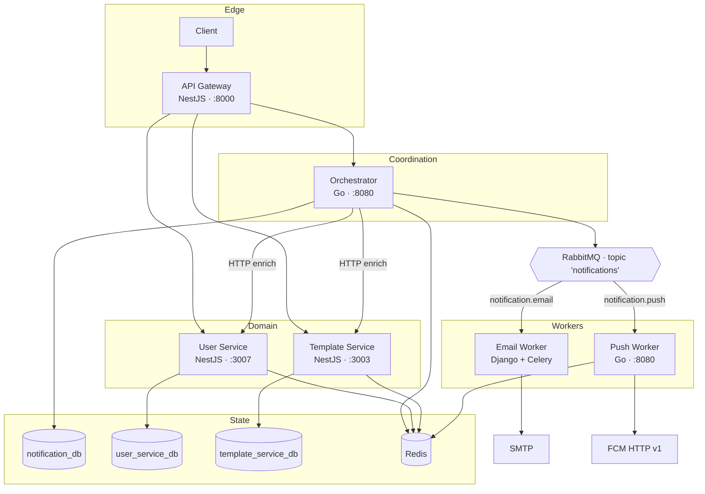
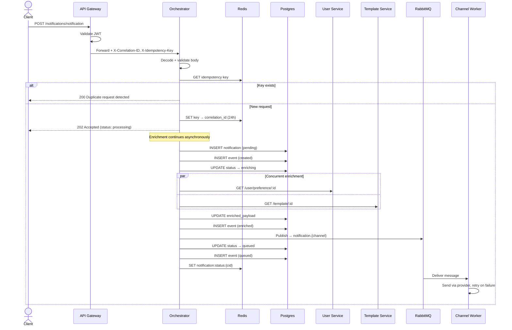
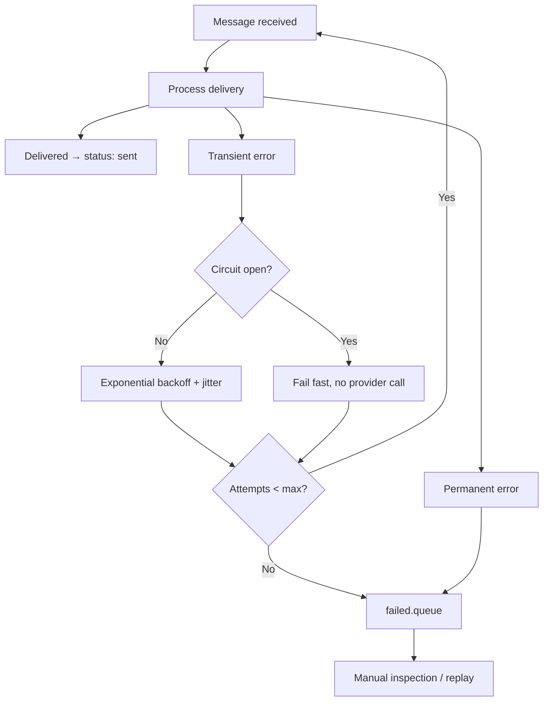

# Architecture

Reference for how the Notification System is put together — component responsibilities, the messaging topology, data model, and the reasoning behind each decision.

Where a pattern is designed but not yet fully implemented, this document says so explicitly and links to [`ENGINEERING_LOG.md`](./ENGINEERING_LOG.md).

---

## 1. Design principles

**Thin edge.** The API Gateway handles authentication, rate limiting, correlation IDs, and routing. It holds no business logic. Anything the gateway knows about the domain is a leak.

**Coordination is separate from delivery.** The Orchestrator knows how to assemble a complete, deliverable message. It does not know what SMTP or FCM are. Adding a channel means adding a consumer, not editing the orchestrator.

**The queue is the boundary.** Accepting a request and delivering it are decoupled by RabbitMQ. Ingestion never blocks on a slow SMTP host, and each channel scales on its own load profile.

**Services own their data.** Each service has its own database. Nothing reaches across a boundary with SQL; enrichment happens over HTTP, authenticated with a shared internal service token (`X-Service-Token`) so that internal reads don't require a user's JWT.

**Every state transition is recorded.** The `notification_events` table is an append-only log. Current status is a projection of it, not the source of truth.

---

## 2. System topology



---

## 3. Components

### API Gateway — `api-gateway/`

**Responsibility:** single entry point. Validates JWTs, decides which routes are public, injects correlation and idempotency headers, and reverse-proxies to the right service.

| | |
|---|---|
| Stack | NestJS 11, Express, `express-http-proxy`, Passport JWT, ioredis |
| Owns | No persistent state. Redis is used for throttle counters only |
| Talks to | User Service, Template Service, Orchestrator |
| Key files | `src/main.ts` (proxy route table), `src/middleware/proxy.middleware.ts`, `src/auth/jwt-auth.guard.ts`, `src/throttler/redis-storage.service.ts` |

Proxy routes are declared as a table in `main.ts`: a path prefix, a target URL, a predicate deciding whether the route requires auth, and an optional header-injection function. The `/notifications` route uses that last hook to attach `X-Idempotency-Key` and `X-Correlation-ID`, generating UUIDs when the client didn't supply them.

The proxy **forwards the full original path**, mount prefix included — it does not strip it. That is a deliberate convention: a downstream service's route prefix is expected to match the gateway mount point, so `/user/signup` at the edge is `/user/signup` at the User Service. It keeps paths stable end to end and makes logs directly comparable across hops.

> **Current limitation.** Proxy routes are registered with raw `app.use()` ahead of Nest's router, so Nest's global guards and interceptors don't apply to them — auth is re-implemented inline, and the configured `ThrottlerGuard` never runs. Restructuring this is Phase 4. Nest-routed endpoints do go through the guard, which honours the `@Public()` decorator (used by `GET /health`).

### Orchestrator — `services/orchestrator/`

**Responsibility:** the workflow engine. Accepts a notification request, enforces idempotency, assigns an ID, records it, enriches it, and publishes it to the right channel queue.

| | |
|---|---|
| Stack | Go 1.25, chi, pgx/v5, tern (migrations), koanf (config), zerolog, `streadway/amqp`, `cenkalti/backoff` |
| Owns | `notification_db` — `notifications`, `notification_events` |
| Talks to | User Service, Template Service (HTTP), Postgres, Redis, RabbitMQ |
| Key files | `internal/handlers/notification.go`, `internal/services/orchestrator.go`, `internal/services/base-client.go`, `internal/repositories/` |

Layered as `handlers → services → repositories`, with `app.App` as the dependency container assembled in `cmd/orchestrator/main.go`.

The HTTP client layer is worth noting: `BaseHTTPClient` wraps every downstream call in exponential backoff with a 30-second elapsed-time ceiling, and treats `4xx` as permanent (no retry) while retrying `5xx`. `UserClient` and `TemplateClient` are thin wrappers over it, each writing into a channel so enrichment can fan out concurrently.

### User Service — `services/user-service/`

**Responsibility:** identity and delivery preferences — who the recipient is, how to reach them, and whether they've consented to each channel.

| | |
|---|---|
| Stack | NestJS 11, Prisma 6, bcrypt, Passport JWT, ioredis |
| Owns | `user_service_db` — `User`, `Preference` |
| Key files | `src/user/user.service.ts`, `src/user/user.controller.ts`, `prisma/schema.prisma` |

Stores `email_opt_in`, `push_opt_in`, `daily_limit`, and `language` per user, plus a JSON `push_token` for device registration. Users and preferences are cached in Redis for 10 minutes.

### Template Service — `services/template-service/`

**Responsibility:** message content and rendering.

| | |
|---|---|
| Stack | NestJS 11, Prisma 6, Handlebars, ioredis |
| Owns | `template_service_db` — `Template`, `TemplateVersion` |
| Key files | `src/template/template.service.ts` |

Templates are **versioned and immutable**: a `PATCH` creates a new `TemplateVersion` rather than mutating the current one, so an in-flight notification always renders against a stable version and content changes are auditable. A template declares which channels it supports (`EMAIL`, `PUSH`) and carries per-channel fields — `subject` for email, `title` for push, a shared Handlebars `body`. Templates are unique on `(event, language)`, which is what makes localized lookup by event possible. Cached for 30 minutes.

### Push Service — `services/push-service/`

**Responsibility:** deliver push notifications via FCM.

| | |
|---|---|
| Stack | Go 1.25, `rabbitmq/amqp091-go`, `redis/go-redis/v9`, `golang.org/x/oauth2`, zerolog |
| Owns | Redis delivery-status records. No relational database |
| Key files | `internal/rabbitmq.go`, `internal/service.go`, `internal/fcm.go` |

A pure worker plus a small operational HTTP surface (`/health`, `/ready`, `/status/:id`). Consumes with manual ack and a configurable prefetch, splits tokens by platform, and sends per-token through the FCM HTTP v1 API using OAuth2 service-account credentials. Results are aggregated into a `DeliveryStatus` and written to Redis with a 7-day TTL. Reconnects to RabbitMQ with bounded retries when the channel drops.

iOS/APNS is scaffolded in config and models but not implemented — iOS tokens currently produce placeholder failure results.

### Email Service — `services/email-service/`

**Responsibility:** deliver email via SMTP, with retry, circuit breaking, and dead-lettering.

| | |
|---|---|
| Stack | Django 5.2, Celery, pybreaker, pika, dj-database-url |
| Owns | `EmailLog` — one row per `request_id` |
| Key files | `notifications/tasks.py`, `notifications/utils.py`, `email_service/celery.py` |

The most defensively written service in the repo. `send_email_task` runs with `acks_late=True`, checks `EmailLog` for an already-delivered `request_id` before doing work, and guards both the SMTP send and the template fetch behind separate circuit breakers (5 failures / 60s reset for SMTP; 3 / 30s for templates). Retries use exponential backoff to a 600-second cap, up to 5 attempts, after which the payload is published to a durable `failed.queue` for manual inspection rather than dropped.

> **Current limitation.** This service is complete on its own but is not attached to the orchestrator's queue and is not in Docker Compose. Connecting it is Phase 1 of the plan.

---

## 4. Request lifecycle



The `202` returns before enrichment completes. The client polls status rather than waiting — which is the point of the design, but also why the status API (Phase 2) matters.

---

## 5. Messaging topology

A single **durable topic exchange** named `notifications`. Routing keys follow `notification.{channel}`, so adding SMS or in-app means declaring one queue and one binding — no existing consumer changes.

| Queue | Routing key | Consumer | Durable |
|---|---|---|---|
| `email_queue` | `notification.email` | Email worker *(not yet attached)* | Yes |
| `push_notifications` | `notification.push` | Push service | Yes |
| `sms_queue` | `notification.sms` | None (reserved) | Yes |
| `failed.queue` | `failed` on `notifications.direct` | Manual inspection | Yes |

Declared in `internal/config/config.go` (`SetupRabbitMQ`), which runs on orchestrator boot and is idempotent.

Messages are published with `DeliveryMode: Persistent`, a `MessageId` set to the notification ID, and a `CorrelationId` set to the correlation ID, plus `channel` and `priority` headers — so a message can be traced back to its database row from the RabbitMQ management UI alone.

> **Current limitations.** `failed.queue` lives on a separate `notifications.direct` exchange and is only reachable from the Celery task, not from the main topology. No queue declares `x-dead-letter-exchange`, and the publisher does not use confirms — so an unroutable message is discarded silently while the notification is still marked `queued`. Both are Phase 3.

---

## 6. Message contract

The orchestrator publishes `dtos.EnrichedNotification`:

```jsonc
{
  "notification_id": "uuid",
  "correlation_id":  "uuid",
  "idempotency_key": "string",
  "user_id":         "uuid",
  "template_code":   "uuid",
  "channel":         "email | push",
  "priority":        "low | normal | high | urgent",
  "user_preferences": { "email_opt_in": true, "push_opt_in": true, "daily_limit": 100, "language": "en" },
  "template":         { "id": "...", "event": "...", "channel": ["EMAIL"], "versions": [ ... ] },
  "variables":        { "name": "Ada", "link": "https://..." },
  "metadata":         { },
  "created_at":       "RFC3339"
}
```

The intent is that a worker receives everything it needs and never calls back into the system to do its job.

> **Current limitation — this is the system's central gap.** The contract is not yet honoured on either side. It carries no resolved recipient (email address, device tokens) and no rendered content, so the push worker — which expects `tokens[]`, `title`, and `body` — receives nothing usable and silently drops the message, and the email worker expects a differently-shaped payload entirely.
>
> The intended fix is to **resolve recipients and render templates during enrichment**, so the message is genuinely self-contained: add `recipient`, `tokens[]`, and rendered `subject`/`title`/`body`, and define the schema in one shared place instead of three separate structs. See [`ENGINEERING_LOG.md` §3](./ENGINEERING_LOG.md) and Phase 1.

---

## 7. Data model

### `notification_db` (Orchestrator)

Migrated with **tern** from embedded SQL in `internal/database/migrations/`, applied automatically on boot.

**`notifications`** — one row per request. Carries identity (`user_id`, `template_id`, `correlation_id`, `idempotency_key`), routing (`channel`, `priority`), payload (`variables`, `metadata`, `enriched_payload` as JSONB), lifecycle timestamps (`enriched_at`, `queued_at`, `sent_at`, `delivered_at`, `failed_at`), failure detail (`error_code`, `error_message`, `retry_count`, `max_retries`), and provider attribution (`provider`, `provider_message_id`).

Status is constrained by a `CHECK` to: `pending → enriching → queued → processing → sent`, with `failed` and `cancelled` as terminal branches.

The table is **range-partitioned by `created_at`**, monthly. Notification volume is append-heavy and naturally time-ordered, so partitioning keeps indexes shallow and makes retention a `DROP TABLE` instead of a mass `DELETE`. The primary key is composite — `(id, created_at)` — since Postgres requires the partition key in any unique constraint.

Indexes are partial (`WHERE deleted_at IS NULL`) and targeted at real access patterns: user history, status sweeps, pending-enrichment scans, and failed-retry scans.

**`notification_events`** — append-only audit log: `created`, `enriched`, `queued`, `sent`, `delivered`, `failed`, `opened`, `clicked`, `bounced`, `unsubscribed`, `cancelled`, `retried`. Every row carries `correlation_id`, so one query reconstructs the full journey of a request across services. Not partitioned.

> **Current limitations.** `create_notification_partitions()` creates only the current and next month and runs once at migration time — nothing schedules it, so inserts will fail once the window lapses. Single-row queries also filter on `id` alone, ignoring the partition key, so they fan out across all partitions. Both are Phase 3.

### `user_service_db` / `template_service_db` (Prisma)

Managed by Prisma migrations per service. `User ↔ Preference` is 1:1 with cascade delete; `Template → TemplateVersion` is 1:N with cascade delete.

> **Current limitation.** The two `schema.prisma` files are byte-identical — each service materializes all four models even though it uses only two. They need to be split, or extracted into a shared package (Phase 6).

---

## 8. Redis usage

Redis serves three distinct jobs. They share an instance but not a namespace.

| Key | Written by | TTL | Purpose |
|---|---|---|---|
| `{idempotency_key}` | Orchestrator | 24h | Duplicate-request suppression |
| `notification:status:{correlation_id}` | Orchestrator | 24h | Status cache for polling without hitting Postgres |
| `push:delivery:{notification_id}` | Push Service | 7d | Per-token delivery results |
| `user:{id}` | User Service | 10m | User record cache |
| `user:preferences:{id}` | User Service | 10m | Preference cache |
| `template:{id}:{latest\|full}` | Template Service | 30m | Template cache |
| `template:event:{event}:{channel}:{lang}` | Template Service | 30m | Event lookup cache |
| throttle counters | API Gateway | window | Rate limiting |

Caching is fail-open throughout — a Redis error logs a warning and falls through to the database rather than failing the request.

> **Current limitation.** The idempotency key is written *before* enrichment runs and is never released on failure, so a failed request's retry is answered as a duplicate for 24 hours. It should be claimed atomically with `SET NX` and released on failure (Phase 3).

---

## 9. Failure handling



Failures are classified rather than treated uniformly. A `4xx` from a downstream service is permanent — retrying a malformed request wastes capacity — while `5xx` and network errors are transient and retried with backoff. Circuit breakers sit in front of SMTP and the template service so a sustained outage fails fast instead of queuing thousands of doomed calls.

**Implementation status by layer:**

| Pattern | Orchestrator → services | Email worker | Push worker |
|---|---|---|---|
| Retry with backoff | Implemented (`cenkalti/backoff`) | Implemented (Celery) | Not implemented |
| Permanent vs transient | Implemented | Implemented | Not implemented |
| Circuit breaker | Not implemented | Implemented (pybreaker) | Not implemented |
| Dead-letter on exhaustion | N/A | Implemented | Not implemented |
| Idempotency | Partial (see §8) | Implemented (`EmailLog`) | Not implemented |

The push worker currently requeues failed messages unconditionally, which loops indefinitely on a poison message. Bringing it to parity with the email worker is Phase 3.

---

## 10. Key design decisions

**Go for orchestration and push; Django for email.** The orchestrator's work is concurrent I/O fan-out — goroutines and channels express that directly, at low per-request cost. Email's work is retry-heavy background processing with scheduling semantics, which is exactly what Celery already solves; reimplementing backoff, retry limits, and dead-lettering in Go would have been strictly worse.

**Topic exchange over direct queues.** Routing keys make channels additive. A new channel is a queue plus a binding, with no change to the publisher or existing consumers.

**Enrichment at the orchestrator, not the worker.** Workers should be dumb and interchangeable. Centralizing enrichment means one place implements preference checks and template resolution, rather than each channel reimplementing them inconsistently.

**Immutable template versions.** Editing a template while notifications reference it would silently change in-flight and historical messages. Versioning makes rendering reproducible and content changes auditable.

**Partitioned notifications table.** Time-series-shaped, append-heavy, with retention requirements. Partitioning keeps working-set indexes small and makes expiry cheap.

**Event log alongside status.** A `status` column answers "where is it now"; the event log answers "what happened and when". Debugging distributed delivery needs the second.

**Async accept with `202`.** Delivery latency is dominated by third-party providers. Blocking the caller on that would couple client-facing latency to SMTP health.

**Config via prefixed environment variables.** The orchestrator loads `ORCHESTRATOR_*` through koanf into a typed struct, then validates it with `go-playground/validator` at startup — so a missing or malformed value fails at boot with a clear message rather than as a nil dereference under load.

---

## 11. Deployment shape

All services are stateless except the databases and brokers, so they scale horizontally behind a load balancer. Workers scale on queue depth; the orchestrator and gateway scale on request rate.

Production considerations, not yet implemented:

- Durable, monitored queues with alerting on depth and DLQ size.
- Postgres backups, PITR, and read replicas for status queries.
- Redis with authentication and HA (Sentinel or managed).
- A scheduled job for partition maintenance.
- Secrets from a manager, not environment files.
- Kubernetes manifests — the stateless services are ready for it; nothing is written yet.

---

## 12. Where the architecture and the code diverge

This document describes the intended design. Several parts are designed but not yet realized, and the gaps are concentrated in one place: **the contract between the orchestrator and its workers** (§6).

For a complete, line-referenced audit of what is implemented versus described — including security issues, correctness bugs, and a phased plan to close them — see **[`ENGINEERING_LOG.md`](./ENGINEERING_LOG.md)**.
